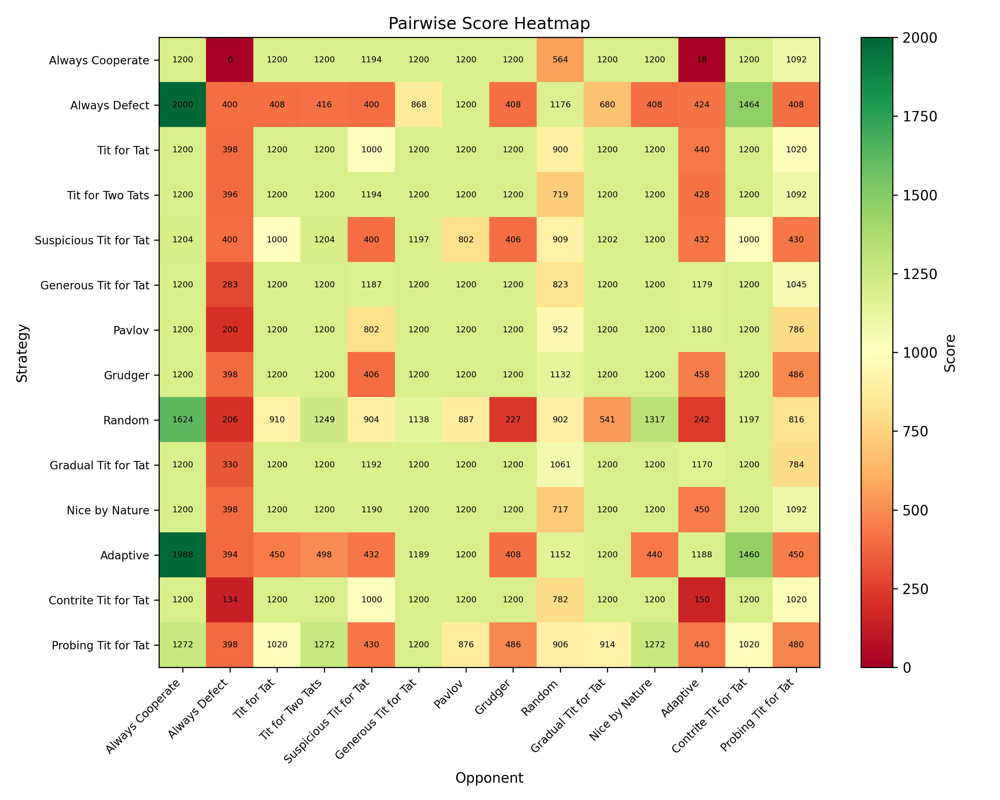
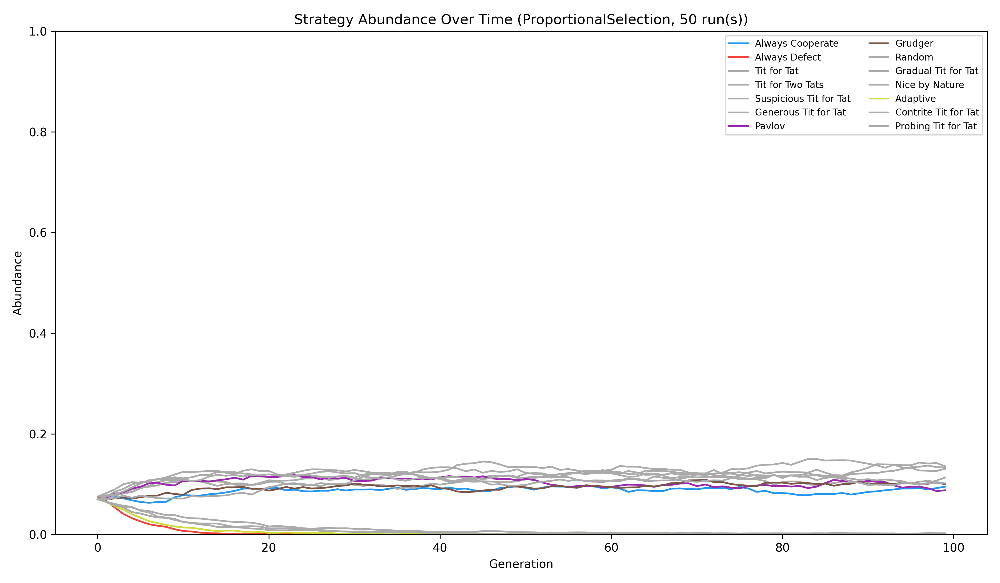

# Prisoner's Dilemma Evolutionary Simulation

> **Built autonomously by [Claude Code](https://claude.ai/code) (claude-sonnet-4-6) inside a [claude-runner](https://github.com/LunaticSodium/ClaudeRunner) Docker sandbox. Zero human-written code.**

A fully self-contained iterated prisoner's dilemma simulation written in **Godot 4 C# (.NET 8)**. The agent bootstrapped the entire environment from scratch inside a clean Docker container — downloading .NET SDK, Godot 4.3-stable-mono, and Python plotting libraries — then implemented all game theory, ran the simulations, and produced the outputs below.

**10/10 hard acceptance criteria passing. Task completed in ~48 minutes.**

---

## What's inside

| Directory | Contents |
|-----------|----------|
| `Interfaces/` | 5 core interfaces: `IStrategy`, `IEvolutionRule`, `IScorer`, `IReporter`, `IPlotter` |
| `Strategies/` | 14 strategies: 12 canonical + `ContriteTFT` + `ProbingTFT` (original) |
| `Simulation/` | Round-robin tournament, population dynamics, ensemble runner, sensitivity analysis |
| `Evolution/` | Genetic algorithm over 64-bit genome lookup tables |
| `Scenes/` | Godot 4 UI scenes (parameter panel, live stacked area chart, results panel) |
| `Tests/` | `BehaviourTests.cs` — deterministic unit tests for all core strategies |
| `Output/` | 19 PNG figures (300 dpi), 4 CSVs, `report.md`, `evolved_strategy.json` |

---

## Key results

- **Round-robin winner:** Gradual Tit for Tat (15,421 pts)
- **Population winner (proportional selection):** Tit for Tat / Nice by Nature
- **Population winner (tournament selection):** Generous TFT / Nice by Nature
- **Evolved strategy:** K=3 history genome, fitness 576.64, ~12.5% abundance at generation 50
- AlwaysDefect collapses in cooperative populations — consistent with Axelrod (1984)

### Pairwise score heatmap


### Population abundance over time (proportional selection)


---

## Build & run

Requires .NET 8 SDK and Godot 4.3-mono.

```bash
# Build
dotnet build PrisonersDilemma.csproj

# Run full simulation (writes Output/)
dotnet run -- --run-sim

# Run unit tests
dotnet run -- --run-tests
```

---

## How it was made

This project was generated by [claude-runner](https://github.com/LunaticSodium/ClaudeRunner), a tool that runs Claude Code as an autonomous agent inside an isolated Docker container. The runner monitors progress, handles rate limits, and verifies acceptance criteria against the output.

The agent:
1. Bootstrapped the entire build environment (no pre-installed tools)
2. Designed and implemented all architecture from scratch
3. Ran the simulations and verified results numerically
4. Generated figures using a Python subprocess plotter
5. Wrote a 2834-word literature-referenced report
6. Evolved a novel strategy via genetic algorithm and re-injected it into the population

See [`Output/report.md`](Output/report.md) and [`Output/acceptance_report.txt`](Output/acceptance_report.txt) for full details.
